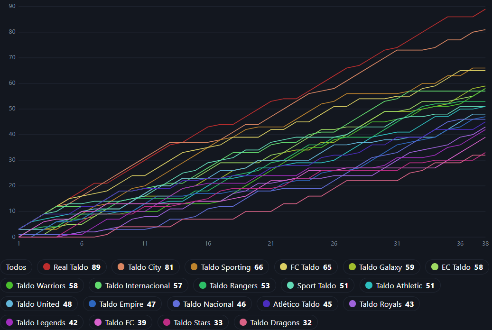

# ⚽ Taldo Manager

Um Football Manager desenvolvido em Python com foco em aprendizado prático de programação.

O projeto está sendo construído do zero para estudar lógica de programação, orientação a objetos, arquitetura de software e desenvolvimento de sistemas.

---

# 🚀 Funcionalidades

## Jogadores

* ✅ Cadastro de jogadores
* ✅ Nome
* ✅ Idade
* ✅ Posição
* ✅ Overall
* ✅ Jogos
* ✅ Gols
* ✅ Assistências
* ✅ Média de nota
* ✅ Melhor nota
* ✅ Pior nota
* ✅ Melhor em campo
* ✅ Hat-tricks
* ✅ Pênaltis convertidos
* ✅ Pênaltis perdidos
* ✅ Clean Sheets
* ✅ Cartões amarelos
* ✅ Cartões vermelhos

---

## Clubes

* ✅ Cadastro de clubes
* ✅ País
* ✅ Dinheiro
* ✅ Elenco de jogadores
* ✅ Cálculo automático da força
* ✅ Forma recente
* ✅ Vantagem de mando de campo

---

## Partidas

* ✅ Simulação baseada na força dos clubes
* ✅ Geração de gols
* ✅ Distribuição de gols por posição
* ✅ Distribuição de assistências por posição
* ✅ Sistema de notas
* ✅ Melhor jogador da partida
* ✅ Clean Sheets
* ✅ Resultado automático
* ✅ Empates
* ✅ Placar completo
* ✅ Hat-tricks
* ✅ Pênaltis
* ✅ Pênaltis perdidos
* ✅ Cartões amarelos
* ✅ Cartões vermelhos
* ✅ Segundo amarelo
* ✅ Eventos cronológicos
* ✅ Ordenação por minuto

---

## Campeonato

* ✅ Cadastro de campeonatos
* ✅ Calendário turno e returno
* ✅ Sorteio automático de rodadas
* ✅ Histórico de partidas
* ✅ Classificação
* ✅ Critérios de desempate
* ✅ Artilharia
* ✅ Assistências
* ✅ Ranking de notas
* ✅ MVP do campeonato
* ✅ Ranking de Clean Sheets
* ✅ Ranking de Hat-tricks
* ✅ Ranking de disciplina (cartões + faltas)
* ✅ Ranking de pênaltis (convertidos / perdidos)
* ✅ Recordes do campeonato

---

## Estrutura

* ✅ Separação dos dados (Seed)
* ✅ Arquivos JSON
* ✅ Carregamento automático dos dados
* ✅ Código refatorado em métodos menores
* ✅ Eventos estruturados em dicionários
* ✅ Processamento cronológico de eventos

---

# 📚 Tecnologias

* Python 3
* Programação Orientada a Objetos (POO)
* FastAPI + Pydantic
* SQLite (`sqlite3` puro, sem ORM)
* HTML + JavaScript puro (frontend sem build)
* JSON (seed)
* Git / GitHub

---

# 🎯 Objetivo

Este projeto tem como objetivo estudar:

* Lógica de programação
* Orientação a Objetos
* Arquitetura de Software
* Estruturação de projetos
* Simulação de sistemas
* Git e GitHub
* Banco de Dados (SQLite)
* APIs web (FastAPI)

---

# 🗺️ Roadmap

## 📌 Status atual (2026-09-02)

O projeto passou do script único para **backend + frontend**:

* **Backend** (`backend/`) — API FastAPI + engine de simulação + SQLite puro
  (sem ORM). `uvicorn app.main:app --reload`, docs em `/docs`. 144 testes.
* **Frontend** (`frontend/`) — `index.html` único, JS puro, consome a API.

Já dá pra:

* Simular uma temporada (38 rodadas) com seed reproduzível.
* **Salvar** cada temporada no SQLite e navegar entre elas.
* Ver classificação (com forma), artilharia, assistências, notas, clean
  sheets, hat-tricks, histórico e recordes.
* Abrir a **página de um clube** (elenco + tabela das 38 partidas).
* Abrir a **página de uma partida** (posse, finalizações, linha do tempo,
  as duas escalações com nota).
* Abrir a **página de um jogador** (ficha + game log: nota, gols e
  assistências partida a partida).
* Ver o **gráfico de pontos por rodada** (corrida pelo título, aba Evolução).
* **Escolher um clube e uma tática** (ofensivo/equilibrado/defensivo) antes de
  simular — a tática mexe nos pesos da engine só desse clube. Ofensivo faz
  mais gols pró e contra; defensivo, menos dos dois lados.
* **Montar a escalação** — formação (4-4-2, 3-5-2, ...) e o XI titular por
  posição. É a preferência: jogadores muito cansados dão lugar a reservas
  ao longo das 38 rodadas.
* **Simular rodada a rodada** — o save nasce "em andamento" e você joga
  uma rodada de cada vez, mexendo na escalação e na tática entre os jogos
  e vendo a tabela evoluir. Sem mudar nada, reproduz a temporada contínua
  com o mesmo seed.
* **Suspensões automáticas** — vermelho (direto ou 2º amarelo) tira o
  jogador do jogo seguinte; a cada 5 amarelos no campeonato, mais um jogo
  de gancho. No modo rodada a rodada os suspensos aparecem fora da
  escalação.



Antes disso: mando de campo + força no placar, fadiga/rodízio de elenco,
banco de reservas e substituições, e a correção do vermelho que bania o
jogador da temporada.

---

## ✅ Versão Atual (v0.5) — Concluída

### Base do jogo

* [x] Cadastro de jogadores
* [x] Cadastro de clubes
* [x] Contratação de jogadores
* [x] Seed em JSON
* [x] Loader automático

### Simulação

* [x] Cálculo de força dos clubes
* [x] Mando de campo
* [x] Forma recente
* [x] Simulação de partidas
* [x] Distribuição de gols
* [x] Distribuição de assistências
* [x] Sistema de notas
* [x] Melhor jogador da partida
* [x] Clean Sheets
* [x] Hat-tricks
* [x] Pênaltis
* [x] Pênaltis perdidos
* [x] Cartões amarelos
* [x] Cartões vermelhos
* [x] Segundo amarelo
* [x] Eventos cronológicos
* [x] Ordenação dos eventos

### Campeonato

* [x] Campeonato
* [x] Calendário turno e returno
* [x] Histórico
* [x] Classificação
* [x] Critérios de desempate
* [x] Artilharia
* [x] Assistências
* [x] Ranking de notas
* [x] MVP do campeonato
* [x] Ranking de Hat-tricks
* [x] Recordes do campeonato

### Código

* [x] Refatoração da classe Partida
* [x] Refatoração da classe Campeonato
* [x] Métodos reutilizáveis
* [x] Organização do projeto
* [x] Sistema de eventos estruturados

---

# 🚧 Próxima Sprint (v0.6)

## Eventos Avançados

* [x] Expulsão afetando força do time (`penalidade_expulsao`)
* [x] Substituições (banco de reservas + rodízio por fadiga)
* [x] Defesas difíceis (`goleiro_defendeu`)
* [x] Suspensão automática por vermelho (perde o jogo seguinte)
* [x] Suspensão por acúmulo de amarelos (a cada 5 no campeonato)
* [ ] Lesões
* [ ] Pênaltis defendidos
* [ ] Acréscimos

## Estatísticas da Partida

* [x] Posse de bola
* [x] Finalizações
* [ ] Chutes no gol (rastreado no engine, falta persistir/exibir)
* [ ] Escanteios
* [x] Faltas (total por jogador — coluna no ranking de disciplina)

## Estatísticas Gerais

* [x] Histórico individual dos jogadores (game log por jogador)
* [x] Estatísticas por temporada (cada simulação salva é um snapshot)
* [x] Ranking de melhores em campo (MVP do campeonato)
* [x] Ranking de cartões (aba Disciplina: 🟥, 🟨, faltas)
* [x] Ranking de pênaltis (convertidos / perdidos)

---

# 💰 Mercado (v0.7)

* [ ] Valor de mercado
* [ ] Salários
* [ ] Sistema financeiro
* [ ] Compra de jogadores
* [ ] Venda de jogadores
* [ ] Negociações
* [ ] Renovação de contrato
* [ ] Evolução por idade
* [ ] Potencial dos jogadores

---

# 🏆 Modo Carreira (v0.8)

* [ ] Temporadas
* [ ] Histórico de campeões
* [ ] Envelhecimento
* [ ] Aposentadoria
* [ ] Geração de jovens
* [ ] Categorias de base
* [ ] Hall da Fama

---

# 💾 Persistência (v0.9) — em andamento

* [x] SQLite (puro, sem ORM; schema em `backend/app/db/schema.sql`)
* [x] Sistema de Save (salvar temporada simulada)
* [x] Carregar Save (listar / abrir / apagar simulações)
* [ ] Autosave

---

# 🌐 Web (v1.0) — em andamento

* [x] API (FastAPI, não Flask)
* [x] Interface Web (`frontend/index.html`)
* [x] Dashboard do campeonato (classificação, rankings, recordes)
* [x] Painel de jogadores (página de jogador + game log)
* [x] Gráfico de pontos por rodada (aba Evolução)
* [x] Interação: escolher clube + tática antes de simular
* [x] Interação: montar a escalação (formação + XI titular)
* [x] Interação: simular rodada a rodada
* [ ] Dashboard financeiro
* [ ] Mercado de transferências
* [ ] Estatísticas avançadas (chutes no gol, escanteios, faltas)

---

# 📁 Estrutura

```text
TaldoManager/
│
├── backend/
│   ├── app/
│   │   ├── api/            # rotas + schemas Pydantic (FastAPI)
│   │   ├── core/           # config
│   │   ├── db/             # schema.sql + conexão SQLite
│   │   ├── domain/         # Jogador, Clube, Partida, Campeonato (engine)
│   │   ├── repositories/   # acesso a cada tabela
│   │   ├── services/       # simulacao_service (orquestra tudo)
│   │   └── main.py         # app FastAPI
│   ├── data/               # seed JSON + banco local (gerado)
│   ├── scripts/            # data_loader
│   └── tests/              # 144 testes (domain, db, repositories, services, api)
│
├── frontend/
│   └── index.html          # SPA em JS puro, consome a API
│
└── README.md
```

Rodar:

```bash
# terminal 1 — API
cd backend && pip install -r requirements.txt && uvicorn app.main:app --reload

# terminal 2 — frontend
cd frontend && python -m http.server 5500
```

---

# 🎯 Meta de Desenvolvimento

**Objetivo:** manter uma rotina consistente de **1 a 3 horas por dia**.

## Regras do Projeto

* ✅ Desenvolver pelo menos uma funcionalidade por semana
* ✅ Não iniciar um sistema novo antes de concluir o atual
* ✅ Testar todas as implementações
* ✅ Refatorar quando necessário
* ✅ Fazer commit ao final de cada sessão
* ✅ Executar `git push` após cada commit
* ✅ Atualizar o roadmap sempre que uma funcionalidade for concluída

---

# 🎯 Objetivo de Curto Prazo

Transformar o Taldo Manager em um simulador completo de campeonatos com:

* ✅ Estatísticas completas
* ✅ Sistema de Save (temporadas salvas em SQLite)
* ✅ Interface web para navegar nos resultados
* ⏳ Eventos avançados (suspensões, lesões, acréscimos)
* ⏳ Mercado de transferências
* ⏳ Evolução dos jogadores
* ⏳ Temporadas contínuas (modo carreira)

---

# 🎯 Objetivo Final

Criar um Football Manager totalmente jogável contendo:

* Banco de Dados SQLite
* API Flask
* Interface Web
* Dashboard completo
* Mercado de transferências
* Sistema financeiro
* Modo carreira
* Temporadas infinitas
* Versão jogável pelo navegador

---

> 🚀 **Lembrete:** consistência vence intensidade. Desenvolver entre **1 e 3 horas por dia** representa aproximadamente **30 a 90 horas de evolução por mês**. Pequenos avanços diários constroem grandes projetos.
